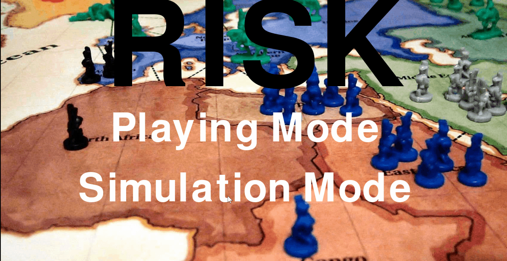

# Risk Game

Risk is strategy game in which each player wants to conquer more cities in the map and keep his cities safe

## How The Game Works

At the start each player has 20 armies to be placed over the available territories in the
board. Each turn consists of two parts: placing armies and attacking. At the beginning of your
turn, count the total number of territories you own and divide by three. This is the number of
additional armies you will receive for territory (ignoring fractions). If the number of territories
divided by three is less than three, you receive three armies instead. After placing your armies
you may declare attacks. You may only attack territories adjacent to your own, where your
territory contains two or more armies. You may attack with any number of armies except for
one, which must remain to defend your territory. There will be no fortifying step, for simplicity.

## Types Of Agents In the Game

### Non-AI Agents

1. A human agent, that can make actions using the GUI.
2. A completely passive agent, that places all of its bonus armies to the territory
with the fewest armies, and doesn’t make any attacks.
3. An aggressive agent, that always places all its bonus armies on the territory with
the most armies, and greedily attempts to attack territories with most armies that
he can attack.
4. A nearly pacifist agent, that places its armies like the completely passive agent,
then conquers only the one territory with fewest armies (if it can).

### AI Agents

1. A greedy agent, that picks the move with best immediate heuristic value.
2. An agent using A* search, with the same heuristic.
3. An agent using real-time A*.
4. A Minimax with alpha-beta pruning agent.

## Mini-MAX Agent vs Passive Agent Gameplay

